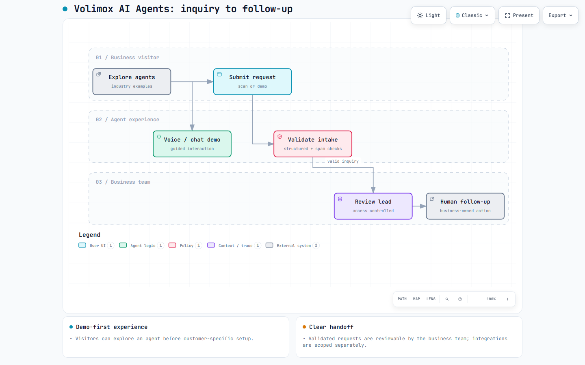

# Volimox AI Agents

**Voice and chat agent experiences that turn business inquiries into structured follow-up.**

Volimox works on AI voice agents and workflow automation for businesses. This private project focuses on the customer-facing experience: industry-specific agent demonstrations, guided voice or chat interactions, lead intake, and a clear path for a business team to review what came in.

**417 commits on `main` · project work began July 2026 · source code private**

## From first interaction to follow-up

The engineering work includes:

- Interactive agent demonstrations that let visitors explore different business scenarios.
- An AI opportunity scan and demo-request flow that collect structured inquiry details.
- Input validation and duplicate/spam controls around lead submission.
- Access-controlled lead review and a human-owned follow-up path.

Customer-specific automations and integrations are scoped to the business and its systems. The public demonstrations illustrate the experience; they do not claim every integration is deployed for every customer.

**Selected stack:** TanStack Start, React, TypeScript, Tailwind CSS, and Supabase/Lovable Cloud.

## Project activity

| Private development repository | Project activity | Commits on `main` | Pull requests |
| --- | --- | ---: | ---: |
| Volimox AI Agents | July 2026 | 417 | 0 |

*Snapshot: September 24, 2026. One January 2025 commit is an imported starter template; its age does not represent two years of Volimox AI Agents development. This public repository contains only this overview and diagram. Application files, lead data, and development history stay private.*
